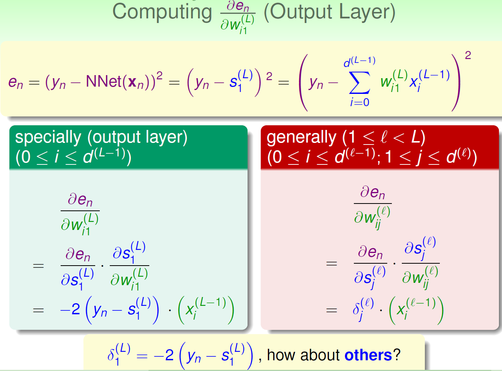

# A Basic NNet with SGD and Backprop

## Error Term

I used squared error. Namely, En = (y - y_predict)^2

## Transform Function

I used the **tanh**.

## Visual Explanation

The differences between the picture above and my actual implementation are:
1. My implementation uses one hidden layer instead of two. 6 nodes in the hidden layer, but that can be adjusted easily.
2. The dataset provided is a multi-class classification problem. That makes the output layer a 3-node one instead of one.
3. In my implementation I applied **tanh** to the output layer.

## Pseudo Backprop
Randomly initialize all weights
for t = 0 to T (I set T to 50000 in my implementation)
1. stochastic: randomly pick a data point from x_train
2. forward: compute all **x** and **s** by multiplying **x** and **w**ij and feeding the results to **tanh**
3. backward: compute all the delta. I'll give the detail of delta later.
4. gradient descent: . l indicates the layer given l = 0 for the input layer.
5. After T iterations, we have the optimized **w's**. Use them to do one forward propagation for the testing set. Compute the accuracy.

## Gradient Descent
- Since this is not a challenge on Gradient Descent, I won't go into details. I don't remember it anyway :)
- What is **eta**? eta is the character looks like n. It represents the step size you take in the GD process.
- What is **delta**?
In order to apply GD, we need the partial derivative of the error term. In the picture below L is the output layer, which is 2 in our case. In the 3-class classification setting, there are 3 **delta's** for the output layer. And in my implementation, I applied the **tanh** to the output layer. So for the delta's of the output layer, we need to multiply an extra tanh.

- How to compute **delta**

## Miscellaneous

- Pictures are from the notes of a Machine Learning course I took 2.5 years ago. I implemented a basic NNet algorithm for binary classification in that class with MATLAB. This Ruby version is a modification of that implementation.
- With the current parameters setting, after a few runs the lowest accuracy achieved is 0.96. I think the provided test set is too small to tell the true accuracy of the setting in practice. The size of the test set is 75.
- This algorithm can be parallelized. If you know parallel programming in Ruby, please tell me how to adapt my code to do so.
- I wrote some code to tranform the raw predicting results to the standard form of 1's and 0's. Later I found that the provided confusion matrix method didn't care. So I commented it out.